<div align="center">

<!-- HERO SECTION -->

# 🐟 I Studied the Eyeballs of Tiny See-Through Fish

### ...and found out that different parts of the eye grow different-shaped brain cells

<br/>


<br/>

<sub>These are 3D models of actual nerve cells from inside a baby zebrafish's eye — built from thousands of microscope images 🔬</sub>

<br/><br/>


</div>

<br/>

---

<br/>

## 🤔 Wait, what is this project even about?

Imagine you're a tiny baby fish only **6 days old**, so small you could sit on the tip of a pencil. Your eyes are basically see-through, which means scientists can look right inside them!

Inside the eye, there are tiny cells called **bipolar cells**. Think of them like **postmen** 📬 — their job is to pick up messages from the cells that detect light, and deliver them to the brain. Without them, the fish's brain would never know what the eyes are seeing.

There are different types of these postmen:
- **S2 cells** — deliver "the light went away!" messages (OFF-pathway) 🌑
- **S4 cells** — deliver "light is here!" messages (ON-pathway) ☀️

And there are different parts of the eye:
- **Dorsal** (top of the eye) — looks DOWN at the ground 👇
- **Ventral** (bottom of the eye) — looks UP at the bright sky 👆

> **The big question:** Do the postmen in the "looking up at the sky" part of the eye look different from the ones in the "looking down at the ground" part? And if so, why? 🤷

<br/>

---

<br/>

## � How did I actually do this?

```mermaid
flowchart LR
    A["🔬 Super-powerful\nmicroscope slices the\nzebrafish eye paper-thin"] --> B["✏️ I traced around\neach cell by hand\n(like colouring in!)"]
    B --> C["📦 Computer stitches\nthe tracings into\n3D shapes"]
    C --> D["📐 My code measures\neach 3D shape\nautomatically"]
    D --> E["🧹 Remove any\ndodgy-looking\ncells (37 removed)"]
    E --> F["� Compare the\ngroups using\nstatistics"]
    F --> G["� Make graphs\nthat tell\nthe story"]
```

<div align="center">



</div>

<br/>

**Here's the step-by-step:**

| Step | What happened | In kid terms |
|---|---|---|
| � **Microscopy** | Serial-section electron microscopy at University of Sussex | We used a microscope so powerful it can see things a MILLION times smaller than your eye can see, and cut the eye into super-thin slices — like slicing bread paper-thin |
| ✏️ **Tracing** | 222 cells manually annotated in WebKnossos | I went through every single slice and carefully traced around each cell by hand — imagine colouring inside the lines, but on hundreds of pages |
| 🤝 **Double-checking** | Two people traced the same cells independently | My supervisor also traced the cells without seeing my work — like two people separately counting sweets in a jar to make sure they get the same number |
| 📐 **Measuring** | 1,300+ line Python pipeline extracts 8 measurements per cell | My code reads each 3D cell and automatically measures its size, shape, width, depth, and more |
| 🧹 **Cleaning** | 37 cells removed (too big, too small, or in weird places) | Some cells looked dodgy — too weirdly-shaped or in impossible locations — so we threw them out to keep the data clean |
| 📊 **Statistics** | Mann-Whitney U tests + Cohen's *d* effect sizes | The maths that tells us "yes, these groups ARE genuinely different — it's not just luck" |

<br/>

---

<br/>

## 🎯 What did I find?

<div align="center">

### The cells at the bottom of the eye (looking up at the sky ☀️) are MUCH wider than the cells at the top!

</div>

<br/>

```
🏆 THE HEADLINE RESULTS:

   Ventral S4 cells have 3× WIDER terminals than Dorsal S4 cells
   ├── Cohen's d = -3.12  (that's a MASSIVE difference)
   └── p < 0.001          (99.9% sure it's not luck)

   They also sit at completely different depths in the eye
   ├── Cohen's d = -4.63  (this is an ENORMOUS difference)
   └── p < 0.001

   My tracing vs my supervisor's tracing?
   ├── Cohen's d < 0.10   (virtually identical = great!)
   └── p > 0.05           (no difference between us)
```

<br/>

**But WHY are the bottom cells wider?** 🤔

Think about it — the bottom of the eye looks UP at the sky. The sky is super bright! So the cells there have evolved to be **wider**, like having a **bigger satellite dish** 📡 to catch more light and cover more ground. The top of the eye looks down at the darker ground, so those cells can afford to be smaller and more precise.

It's like the difference between a **massive pair of sunglasses** (for the bright sky part) and a pair of **tiny binoculars** (for the detailed ground-viewing part). Same eye, different tools for different jobs! 🕶️🔭

<br/>

<table>
<tr>
<td width="33%" align="center">

<br/><sub><b>Dorsal region cells</b> — smaller, narrower</sub>
</td>
<td width="33%" align="center">

<br/><sub><b>3D render</b> — each colour is a different cell</sub>
</td>
<td width="33%" align="center">

<br/><sub><b>Ventral region cells</b> — notice how they spread wider!</sub>
</td>
</tr>
</table>

<br/>

---

<br/>

## 📈 The Pretty Pictures (Figures)

<table>
<tr>
<td width="50%" align="center">

<br/><sub><b>Figure 1</b> — Each dot is one cell. Red = S2, Blue = S4.<br/>The different cell types sit at different depths — exactly as expected! </sub>
</td>
<td width="50%" align="center">

<br/><sub><b>Figure 2</b> — Comparing dorsal vs ventral — the boxes show the range,<br/>the dots are individual cells. Stars (***) mean "big deal, statistically!" </sub>
</td>
</tr>
<tr>
<td width="50%" align="center">

<br/><sub><b>Figure 4</b> — Bigger cells = more surface area (makes sense!).<br/>The shaded bands show how confident we are in the trend line.</sub>
</td>
<td width="50%" align="center">

<br/><sub><b>Figure 5</b> — The "cheat sheet" — darker colour = bigger difference.<br/>Stars tell you how confident we are. The Dorsal S4 vs Ventral S4 column is 🔥</sub>
</td>
</tr>
</table>

<div align="center">
<br/>

<br/><sub><b>Figure 3</b> — Me vs my supervisor's tracings. If we agreed perfectly,<br/>every dot would be on the dashed line. They're  close. </sub>
</div>

<br/>

---

<br/>

## � The Numbers Behind It All

| What I compared | What I measured | How different? | Sure it's real? |
|---|---|---|---|
| Dorsal S4 vs Ventral S4 | How wide the cells spread | **d = −3.12** (HUGE) | ***p < 0.001*** ✅ |
| Dorsal S4 vs Ventral S4 | How deep they sit in the eye | **d = −4.63** (MASSIVE) | ***p < 0.001*** ✅ |
| Dorsal S4 vs Ventral S4 | Height-to-width ratio | **d = 2.35** (HUGE) | ***p < 0.001*** ✅ |
| S2 vs S4 | Surface area | **d = 0.92** (Large) | ***p < 0.001*** ✅ |
| Me vs Supervisor | Everything | **d < 0.10** (tiny = great!) | p > 0.05 (no diff) ✅ |

> **How to read this:** Cohen's *d* tells you how big the difference is. Anything over 0.8 is considered "large." My main finding has *d* = 3.12 and 4.63, which is absolutely enormous — these cell populations genuinely look different from each other.

<br/>

---

<br/>

## 🗂️ What's in this repository?

```
zebrafish-bc-morphometrics/
│
├── 📄 README.md                        ← The technical documentation
├── 📄 PROJECT_OVERVIEW.md              ← You are here! 
│
├── 🐍 morphometrics_pipeline.py        ← The big one — 1,339 lines of Python
│                                          that does everything from reading 3D
│                                          files to generating all the figures
│
├── 📂 analysis/
│   └── morphometric_analysis.py        ← A simpler standalone analysis script
│
├── 📂 sensitivity_analysis/
│   └── sensitivity_analysis.py         ← "Does the finding still hold if we
│                                          DON'T remove the dodgy cells?" (yes!)
│
├── 📂 data/                            ← All the spreadsheets
│   ├── morphometrics_clean.csv         ← 185 good cells, 24 measurements each
│   ├── morphometrics_raw.csv           ← All 222 cells before cleaning
│   ├── exclusions_log.csv              ← The 37 kicked-out cells & why
│   ├── statistical_results.csv         ← All 32 statistical tests
│   ├── descriptive_stats.csv           ← Averages, medians, ranges
│   └── metadata_summary.csv            ← How many cells per group
│
├── 📂 figures/                         ← The 5 publication-quality charts (PNG + SVG)
└── 📂 assets/                          ← The cool 3D reconstruction images
```

<br/>

---

<br/>

## 💡 Skills I Used 

<table>
<tr>
<td align="center" width="20%">
<h3>🐍</h3>
<b>Python</b><br/>
<sub>1,300+ lines of clean, documented code that runs the entire analysis from start to finish</sub>
</td>
<td align="center" width="20%">
<h3>📐</h3>
<b>3D Maths</b><br/>
<sub>Built a custom 3D file reader, calculated volumes using tetrahedron maths, computed convex hulls</sub>
</td>
<td align="center" width="20%">
<h3>📊</h3>
<b>Statistics</b><br/>
<sub>Used proper statistical tests to prove the differences are real, not random luck</sub>
</td>
<td align="center" width="20%">
<h3>🎨</h3>
<b>Data Visualisation</b><br/>
<sub>Created publication-quality figures using Matplotlib & Seaborn — violin plots, heatmaps, regressions</sub>
</td>
<td align="center" width="20%">
<h3>🧠</h3>
<b>Neuroscience</b><br/>
<sub>Applied knowledge of retinal circuitry, IPL stratification, and electron microscopy methods</sub>
</td>
</tr>
</table>

<br/>

---

<br/>

## ⚡ Want to run it yourself?

```bash
# Grab the code
git clone https://github.com/Vanz23-23/zebrafish-bc-morphometrics.git
cd zebrafish-bc-morphometrics

# Install the stuff it needs
pip install pandas numpy scipy matplotlib seaborn

# Run the analysis
python analysis/morphometric_analysis.py

# Or regenerate all the figures
python morphometrics_pipeline.py --figures-only
```

<br/>

---

<br/>

<div align="center">

## 👤 Who made this?

**Vanz Labitad**
<br/>
MSci Neuroscience · University of Sussex
<br/><br/>
Supervised by **Katarina Moravkova** · Baden Lab, School of Life Sciences

<br/>

---

<sub>Code: MIT License · Data: academic use · Raw microscope images: property of University of Sussex</sub>

</div>
